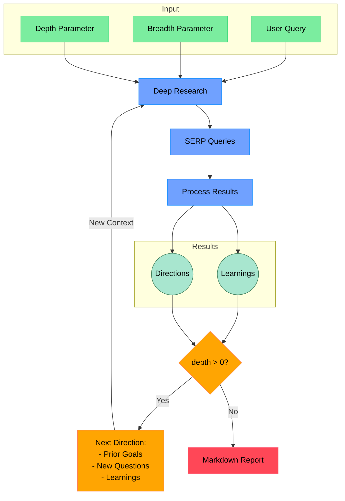

# Open Deep Research

An AI-powered research assistant that performs iterative, deep research on any topic by combining search engines, web scraping, and large language models. If you like this project, please consider starring it and giving me a follow on [X](https://x.com/dzhng).

The goal of this repo is to provide the simplest implementation of a deep research agent - e.g. an agent that can refine its research direction overtime and deep dive into a topic. Goal is to keep the repo size at <500 LoC so it is easy to understand and build on top of.

## How It Works



## Features

- **Iterative Research**: Performs deep research by iteratively generating search queries, processing results, and diving deeper based on findings
- **Intelligent Query Generation**: Uses LLMs to generate targeted search queries based on research goals and previous findings
- **Depth & Breadth Control**: Configurable parameters to control how wide (breadth) and deep (depth) the research goes
- **Smart Follow-up**: Generates follow-up questions to better understand research needs
- **Comprehensive Reports**: Produces detailed markdown reports with findings and sources
- **Concurrent Processing**: Handles multiple searches and result processing in parallel for efficiency

## Requirements

- Node.js environment
- API keys for:
  - Firecrawl API (for web search and content extraction)
  - OpenAI API (for o3 mini model)

## Installation & Setup

### Prerequisites
- Node.js v22.x
- npm (comes with Node.js)
- A Firecrawl API key (get one at [Firecrawl](https://firecrawl.co))
- An OpenAI API key (get one at [OpenAI](https://platform.openai.com))

### Installation Steps

1. Clone the repository:
```bash
git clone https://github.com/dzhng/deep-research.git
cd deep-research
```

2. Install dependencies:
```bash
npm install
```

3. Create a `.env.local` file in the root directory with your API keys:
```env
FIRECRAWL_KEY="your-firecrawl-key"
OPENAI_KEY="your-openai-key"

# Optional: If you plan to self-host Firecrawl, uncomment this:
# FIRECRAWL_BASE_URL="http://localhost:3002"
```

### Running the Agent

1. Start the research agent:
```bash
npm run start
```

2. When prompted, enter:
   - Your research query (what topic you want to research)
   - Research breadth (recommended 2-10, default 4) - determines parallel research paths
   - Research depth (recommended 1-5, default 2) - determines how deep to go in each path

3. The agent will begin its research process and generate two files:
   - `output.md`: Contains the detailed research findings
   - `report.md`: Contains a summarized version of the research

### Troubleshooting

- If you encounter 500 errors with Firecrawl:
  - Make sure your API key is valid
  - If using self-hosted Firecrawl, ensure the server is running at the specified URL
  - Comment out the `FIRECRAWL_BASE_URL` line in `.env.local` to use the hosted service

- If you see OpenAI API errors:
  - Verify your OpenAI API key is valid and has sufficient credits
  - Check if you have access to the required models

## License

MIT License - feel free to use and modify as needed.
